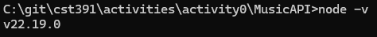
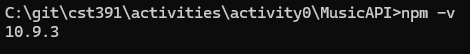
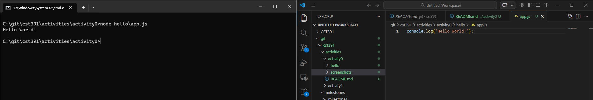
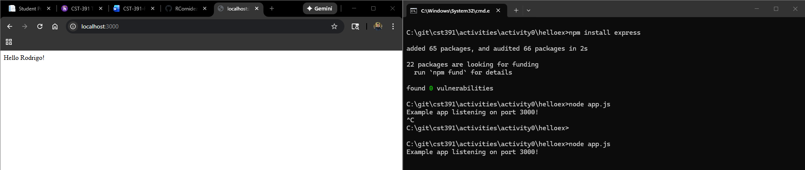
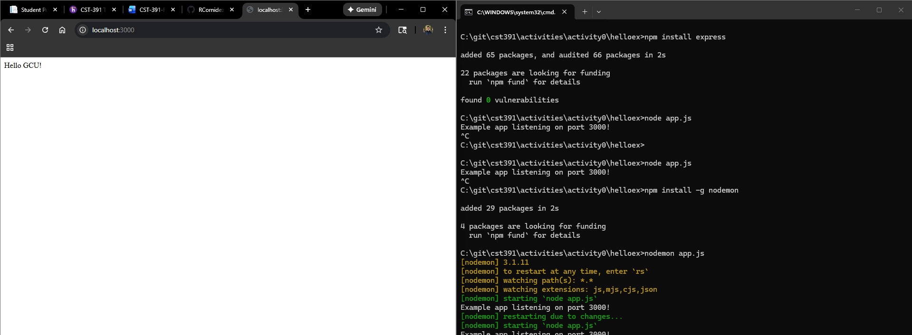
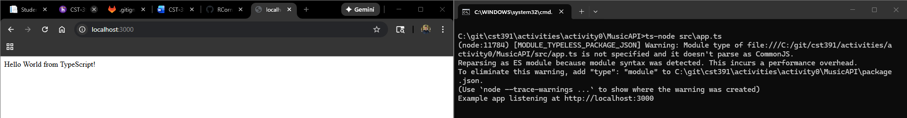
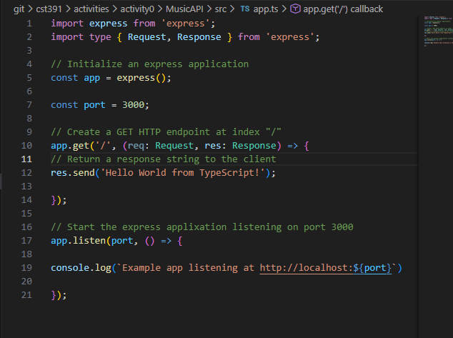

# CST-391 Activity 0: Tools Installation and Initial Applications

## Introduction
In this activity we are installing node and npm. Node is the JavaScript runtime that will be used to run the Hello World console application and TypeScript Express API. NPM is the node package manager used to install Express.js and the TypeScript dependencies.

## 1. node -v. 

*Screenshot of node version, showing proper installation.*

## 2. npm -v. 

*Screenshot of npm version, showing proper installation.*

## 3. Hello World console application. 

*Screenshot of node console application showing hello world text.*

## 4. Hello World in the browser. 

*Screenshot of express application displaying custom hello text.*

## 5. Hello World in the browser with nodemon utility. 

*Screenshot of express application ran with nodemon showing custom hello text.*

## 6. Hello World Typescript in the browser. 

*Screenshot of express typescript application showing hello world in browser.*

## 7. Commented app.ts.

*Screenshot of commented app.ts file.*

## Conclusion
The activity steps are listed above showing the necessary screenshots and descriptions. We have the initial installation of Node and NPM, Hello world console application, Hello World in the browser with both Node and nodemon, as well as the Typescript Hello world in the browser and a detailed commented app.ts file for that same portion.
