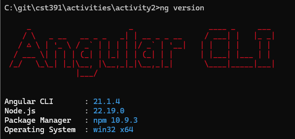
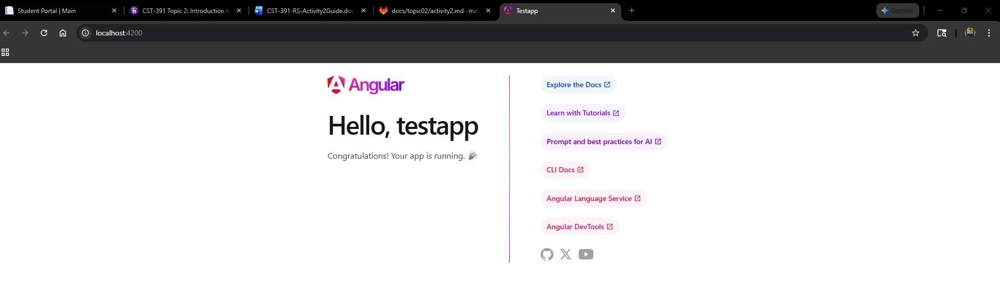
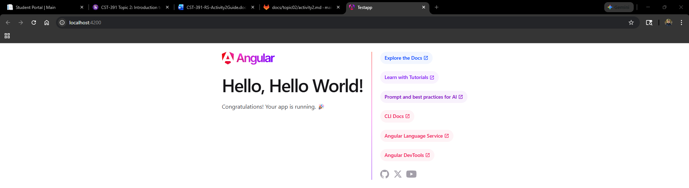
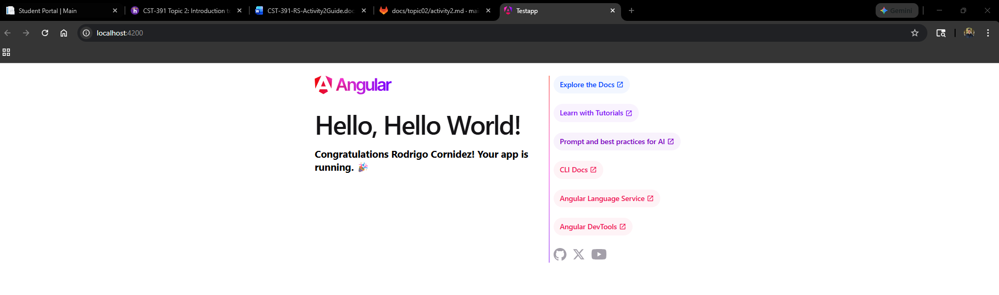

# Activity 2

- Author: Rodrigo Cornidez
- Date: February 16, 2026

# Introduction
This activity will have us step through the installation, creation, and serving of an Angular app. We will also review the project structure by analyzing the folders and files.

# Verify Angular CLI Installation

*This screenshot shows the valid ng cli installation.*

# Serve the TestApp

*This screenshot shows the default app template in the browser.*

# Change Title in TestApp

*This screenshot show the default app template showing the "hello world" instead of the previous "testapp".*

# Add Message Variable

*This screenshot shows the message variable being rendered as an H3 tag.*

# Research

### A. Inspect and describe the purpose of each folder and file in the project:
> Note: I did answer the original question based on the folders provided. They are not included in my boilerplate app by default but their purpose is understandable and easily added (the assets and environemtns folders). 

|Folder/File|Purpose|
|--|--|
|node_module|Contains the third-party packages installed by npm.|
|src|The source folder containing all the applications code.|
|src/app|The main application folder containing the Angular Components|
|src/asset|Contains static files such as images or icons.|
|src/environments|Contains environment configuration files.|
|angular.json|The Angular configuration file that defines build options and cli behavior.|
|package.json|Node.js project manifest file that lists all the project dependencies and versions. It also contains scripts.|
|tsconfig.json|The TypeScript compiler configuration file.|

### B. Provide a brief overview and purpose for each of the following files:
> Note: The syntax has changed with the latest version of Angular. I reflected this change in these answers.

|File|Purpose|
|--|--|
|main.ts|This file is the application entry point for Angular.|
|app.css|This file is the style sheet used for the app component it gets injected within the app.ts and used in app.html|
|app.html|This is the html template for the app component that is linked in the app.ts file.|
|app.ts|This is the component class for the app component. The business logic is implemented in this file.|
|app.module.ts|This module file is no longer relevant with the latest update of Angular. It was used for declaring components and importing dependencies. Now this is handled with the @Component annotation above the class in the app.ts|

# Conclusion
This activity was straightforward in its setup and serving of an Angular app using the ng CLI tool. We also reviewed the purpose of the core folders and files int the angular template project.