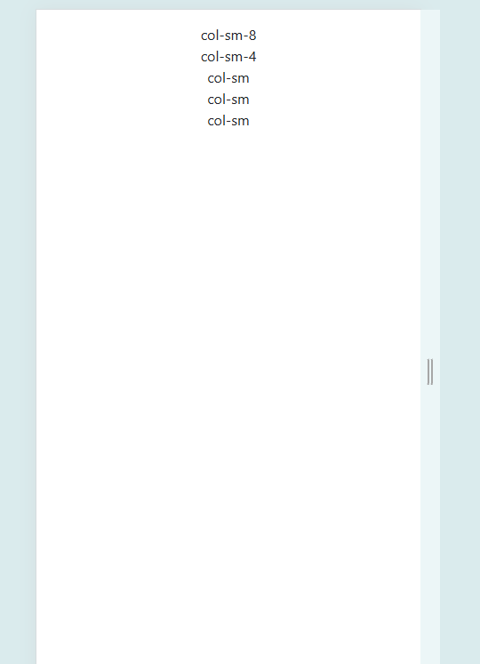
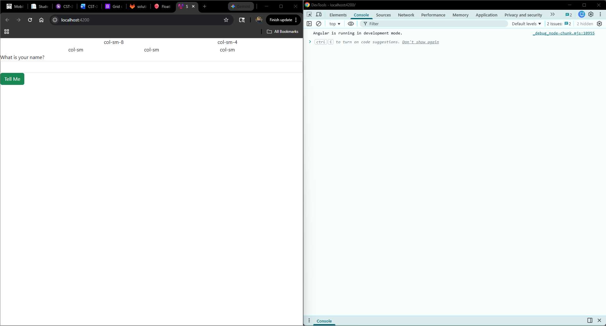
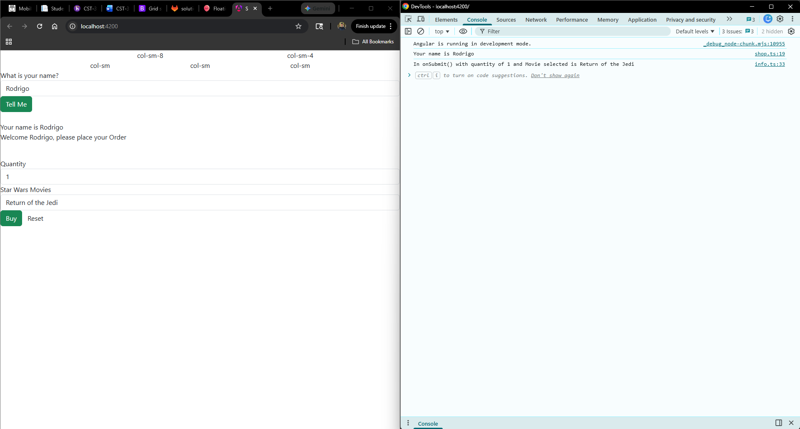
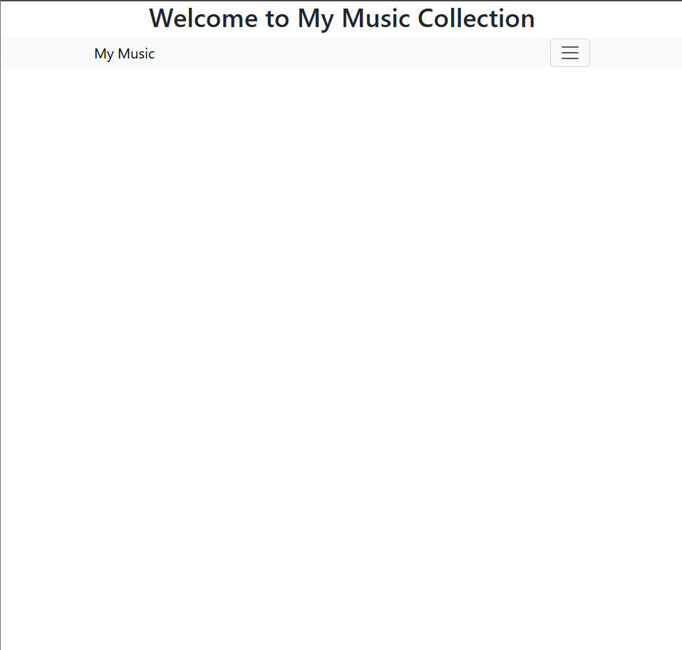
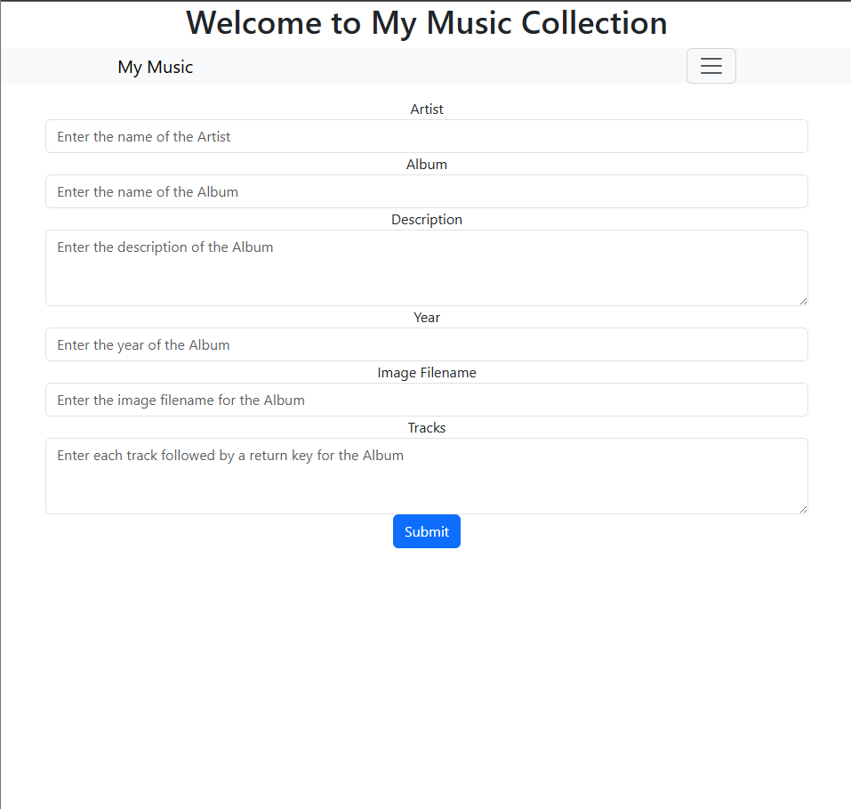
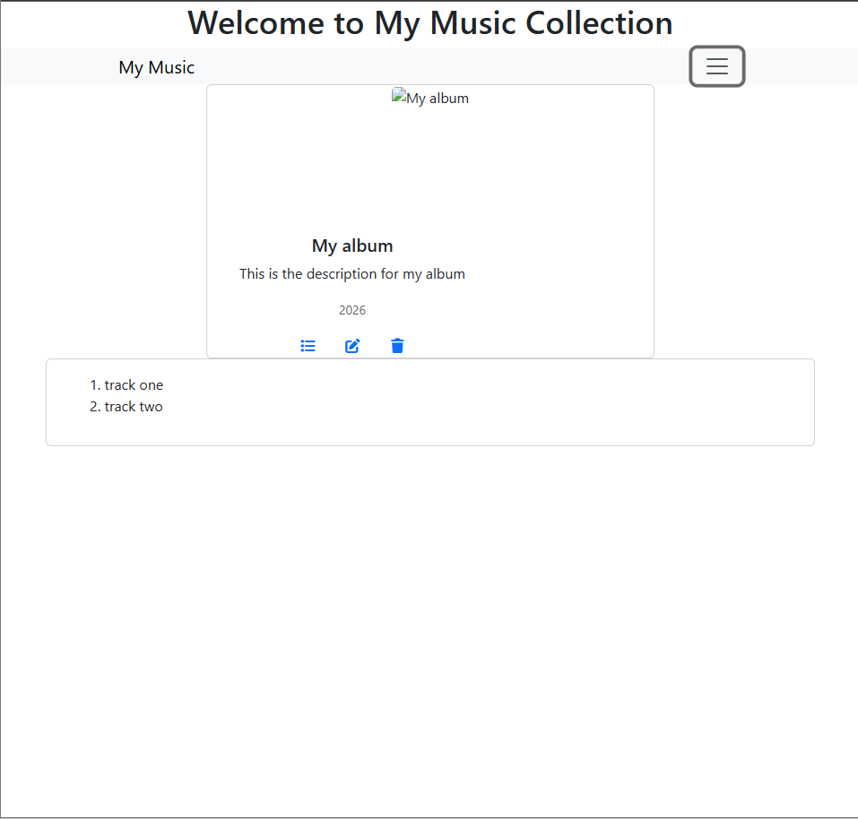
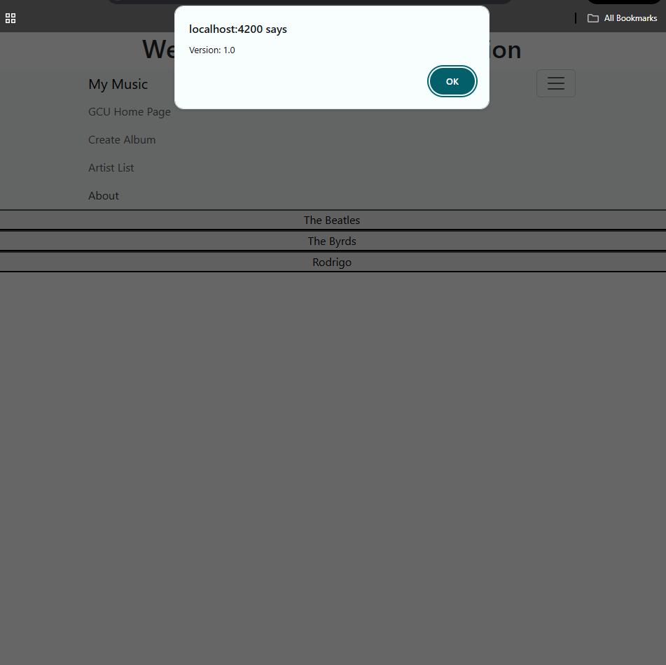

# Activity 3

- Author: Rodrigo Cornidez
- Date: March 1, 2026

# Introduction
This activity will have us step through the installation, creation, and serving of an Angular app using responsive design libraries: bootstrap and popper.

# Part 1

## Create Simple Application

1. Small Screen

*This screenshot shows the small responsive bootstrap grid design*

2. Large Screen

*This screenshot shows the large responsive bootstrap grid design*

## Before Name being entered

*This screenshot shows sample form before the name being entered.*

> Note: I had to use the new syntax for this to work with the conditional decorator @if instead of ngIf

## After Name being entered

*This screenshot shows sample form after the name being entered.*

> Note: I had to use the new syntax for this to work with the conditional decorator @if instead of ngIf

# Research

1. `@Input()` is an Angular decorator that marks a class property as a one-way input binding. This would allow a parent component to pass data to the child component.

2. `[value]` is the property binding syntax between the info.ts and the info.html. This allows the form to be updated when the value is updated in the business logic (.ts file in this case)

3. `[(ngModel)]` is Angulars two-way data binding syntax. It is used to keep the component and html template in sync. So when the user updates the html template, the underlying TypeScript business logic is updated properly.

# Part 2*

## a. Initial hompage

*This screenshot shows the initial home page route.*

## b. GCU homepage

*This screenshot shows the GCU nav link working*

## c. Create Album page

*This screenshot shows the create album route*

## d. Artist List page showing your added album/artist

*This screenshot shows the artist list page with the selected artist I created*

## About Box

*This screenshot shows the about alert box.*

## Research
The commented music service logic can be found here [Music Service](/musicapp/src/app/services/music.service.ts)

# Conclusion
In this activity we created an Angular app that uses a service to manage artists, albums, and tracks. We displayed this data using Bootstrap and added to it using Angular Forms.