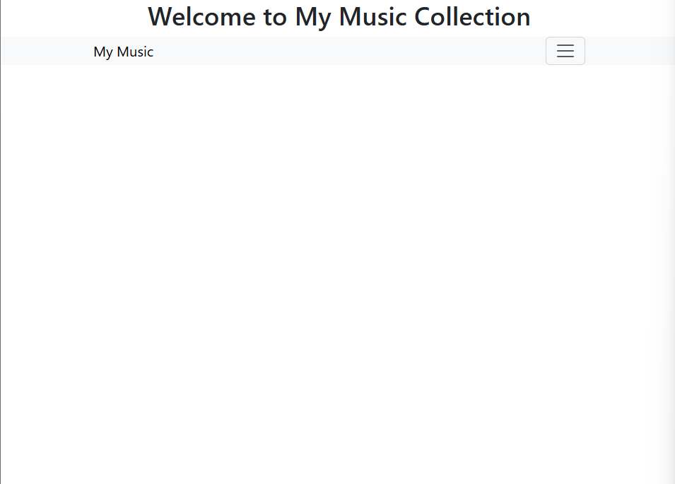
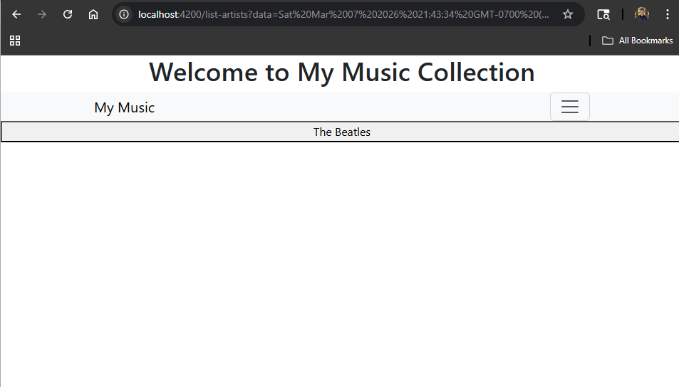
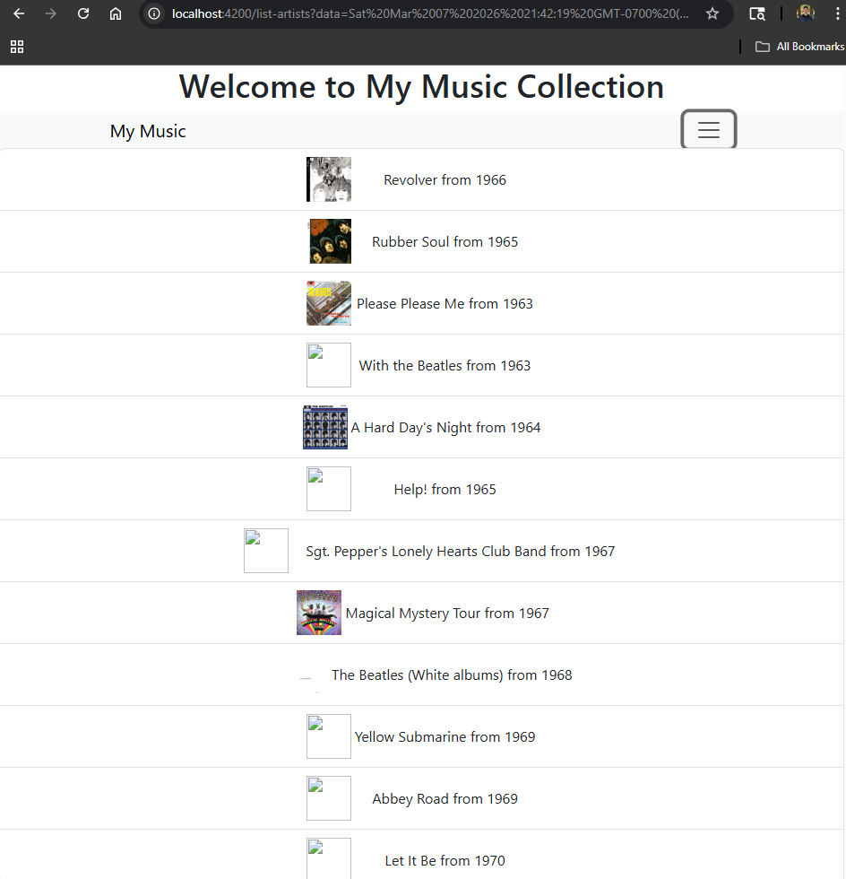
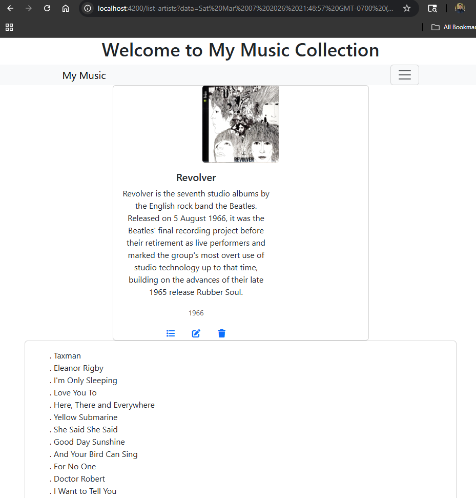
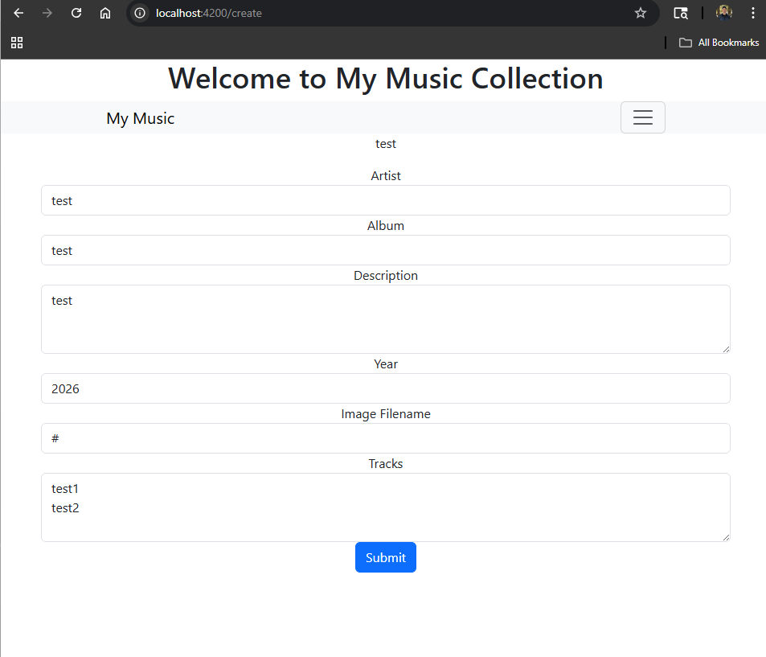

# Activity 4
- Author: Rodrigo Cornidez
- Date: March 7, 2026

# Introduction
In this assignment we are converting the static data service to work with the previously created express API.

# Screenshots
1. Main Application Screen

*This screenshot shows the main application screen*

2. Artist List Screen

*This screenshot shows the artist list screen*

3. Album List Screen

*This screenshot shows the album list screen*

4. Album Display Screen (With Tracks)

*This screenshot shows the album display screen*

5. Add Album Screen

*This screenshot shows the add album creen*

> Note: I excluded the optional edit and delete screenshots.

# Research
An Angular application is able to maintain a logged in state by using JSON Web Tokens (JWT). They are stored either in-memory (with specific state libraries), local storage, session storage, or as an httpOnly cookie. If the auth state is needed for business logic the token or state will need to be stored in-memory or in local or session storage. If your routes are protected and the state is not needed in the client you can protect the API endpoints serving the Angular application.

# Conclusion
This assignments requirements were interesting and straightforward it showed a separated development approach where we previously built the API and tested with postman, built the angular app with mock data and services, and then connected the two in this assignment.