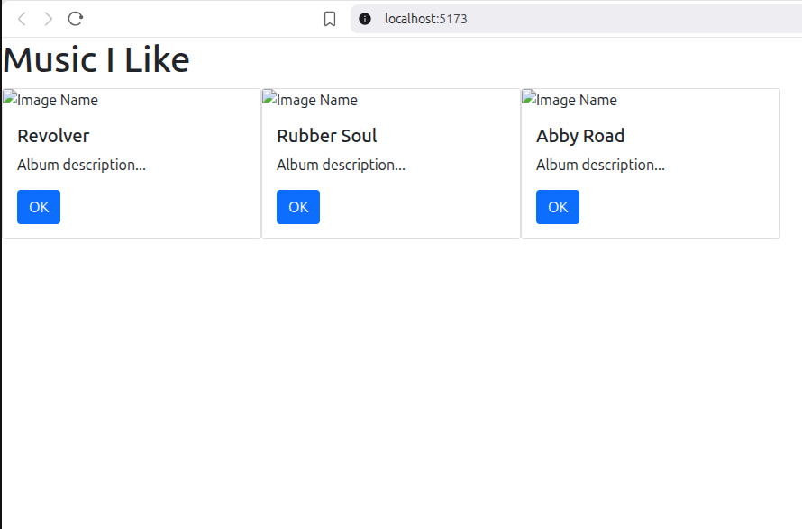
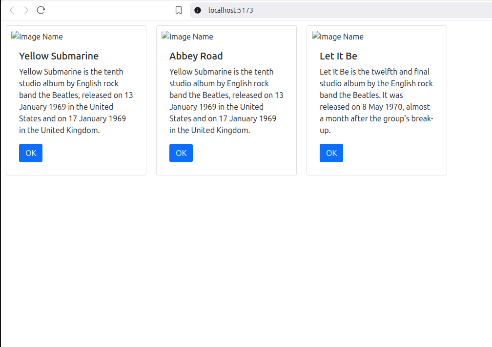
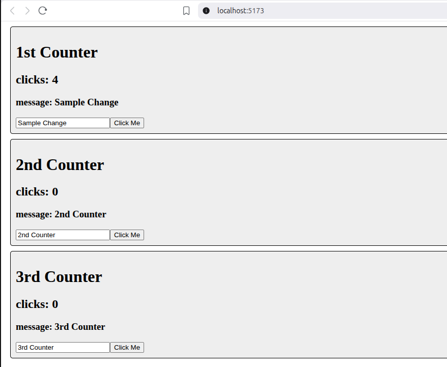

# Activity 5
- Author: Rodrigo Cornidez
- Date: March 9, 2026

# Introduction
In this activity assignment we are learning how to create a react application as well as a reusable card component.

# Screenshots
## Music Application
*In this screenshot you can see the three card components. The image urls from wikipedia are blocked likely due to cors restrictions.*
1. stateless version

2. stateful version

## State Change Application
*In this screenshot you can see the three counter components. They each have their individual state.*

# Conclusion
While working on this activity I had to switch from create-react-app over to vite using the "npm create vite@latest". Unfortunately, the create-react-app is deprecated and has some severe vulnerabilities. I did learn how to create a component, pass properties to components, and handle working with state.
