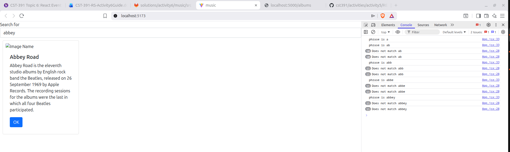
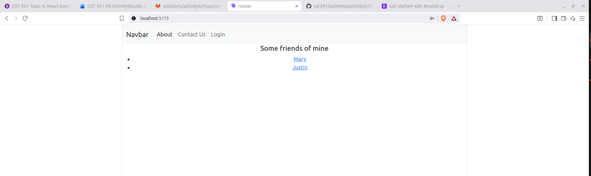
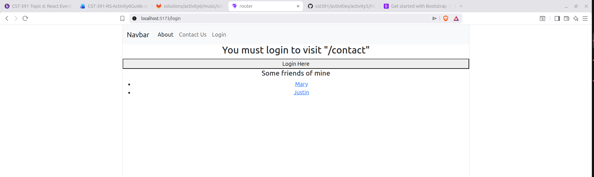
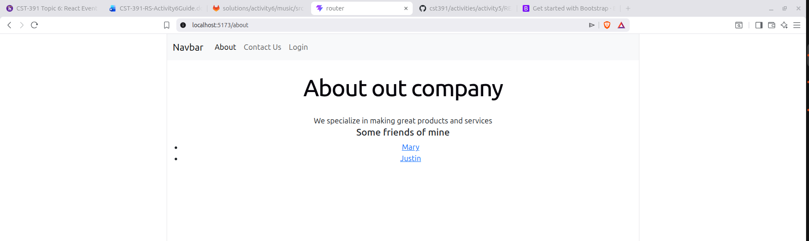
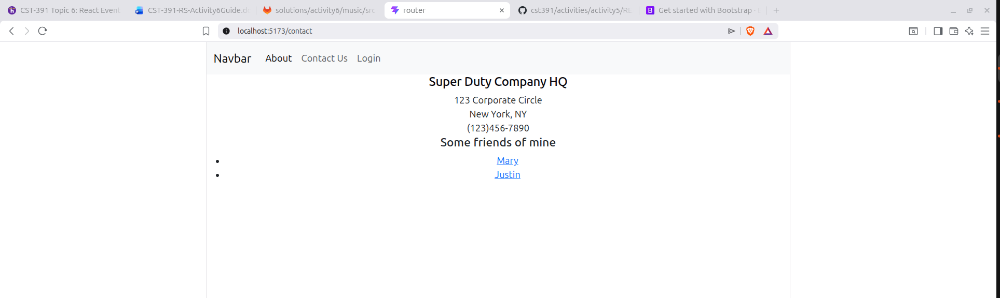
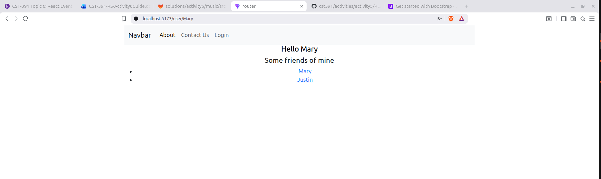
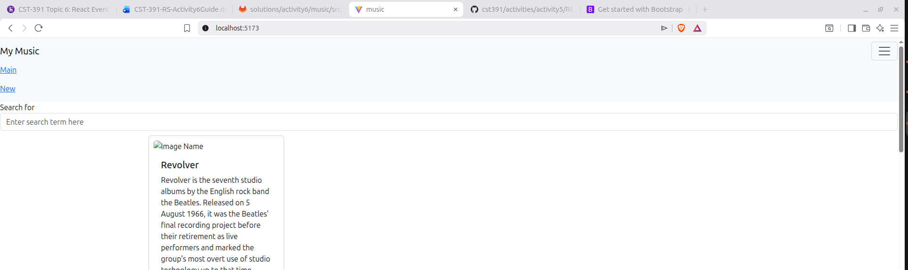
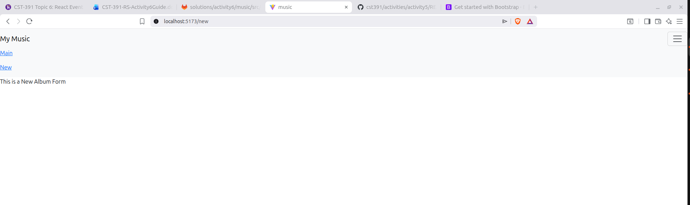
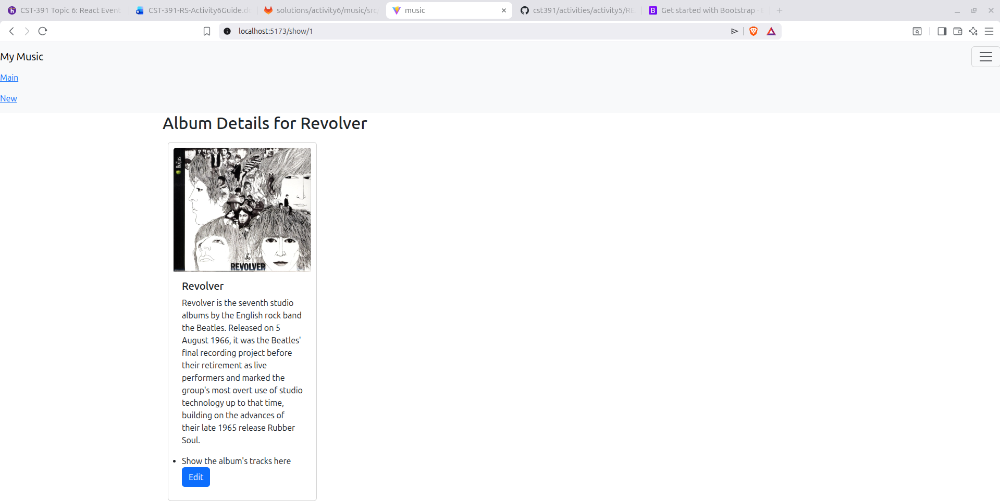

# Activity 6
- Author: Rodrigo Cornidez
- Date: March 22, 2026

# Introduction
This assignment looks like it will have us dive deeper into react hooks and client-side routing with react-router-dom. It should provide a good base for our upcoming milestone assignment.

# Screenshots
## React Music Application (#3 – External Data Sources)
*In this screenshot you can see the albums list that have been filtered by the search input form. In order to achieve the albums being read from an external source (in this case - MySQL database) I had to use axios to query the api (running on port 5000). This also required the use of reacts useState and useEffect hooks to query on mount of the component, and to update the state using setAlbumList.*

## Mini App #2 - Routing Application Demo
*These screenshots show the various pages and components created within this react-router-dom application. We created various pages to display about information, contact information, login, and the user details. We have a Private Route component that behaves like redirect middleware and a bootstrap navbar.*

1. Root Element
*You can see the empty root element, the nav bar, and the friends list.*

2. Login Page
*You can see the redirect information where we were sent to the login page from the original page route*

3. About Page
*You can see the about page contents*

4. Contact Page
*You can see the contact page contents*

5. User Page
*You can see the user page contents. Here we are using a parameter to get the username "Mary".*

## React Music App (Part 4: Navigation Routing)
*In this portion of the assignment we added routing to the music application. We added routes to display a new album page, a selected album, and the album list. We moved the album list to be in its own component and created the NavBar component to assist in navigation between the main index route and the new album page.*

1. Main
*This screenshot shows the main page with the navbar, search input, and album list.*

2. New Album Page
*This screenshot shows the placeholder text for the new album form page.*

3. One Album Page
*This screenshot shows the selected album page, we use the url parameter to filter and display the selected album.*

# Conclusion
This assignment was in-depth and had some really meaningful examples. We covered the standard use of the useState and useEffect react hooks to manage the application's state for various variable and to handle making API calls on component mount in the browser. We also covered how to create routes, navigate to those routes, and access url parameters in the resulting components using the react-router-dom library.
