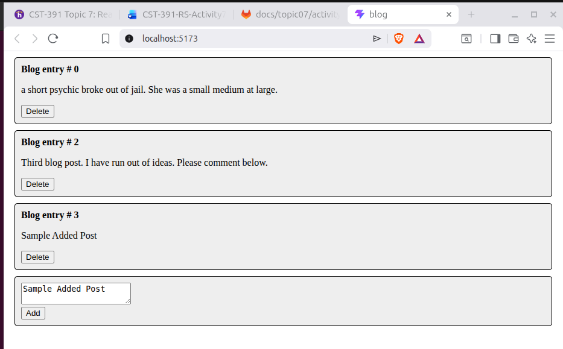
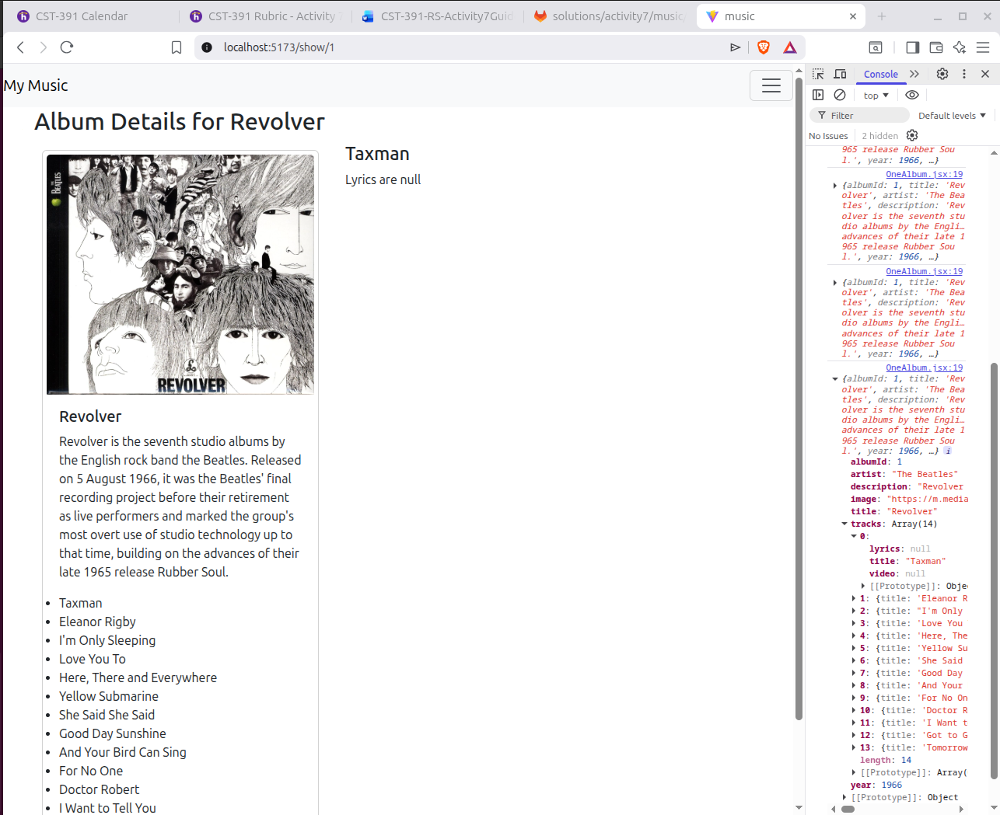
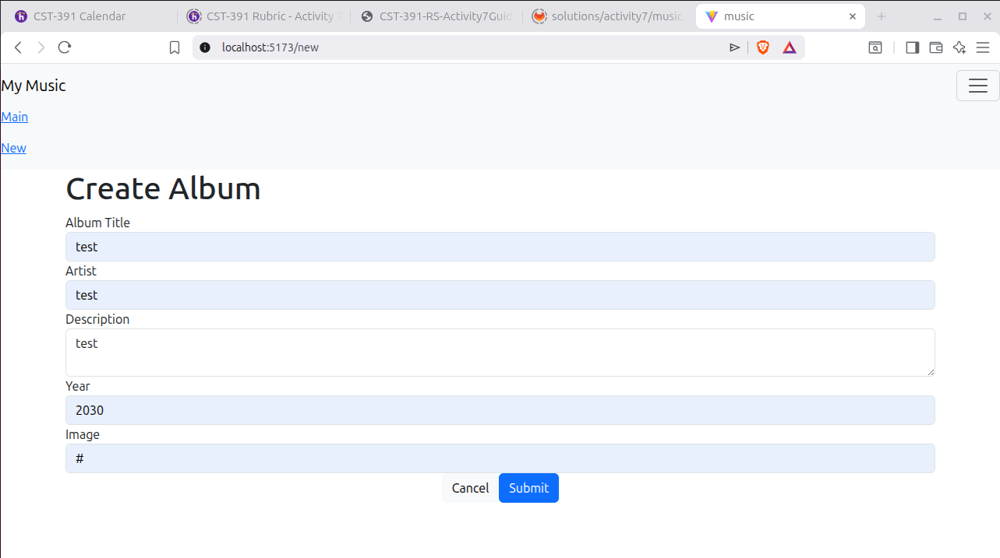
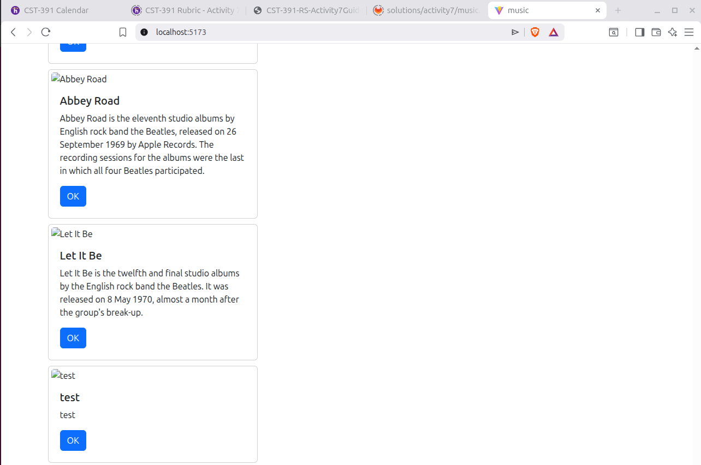
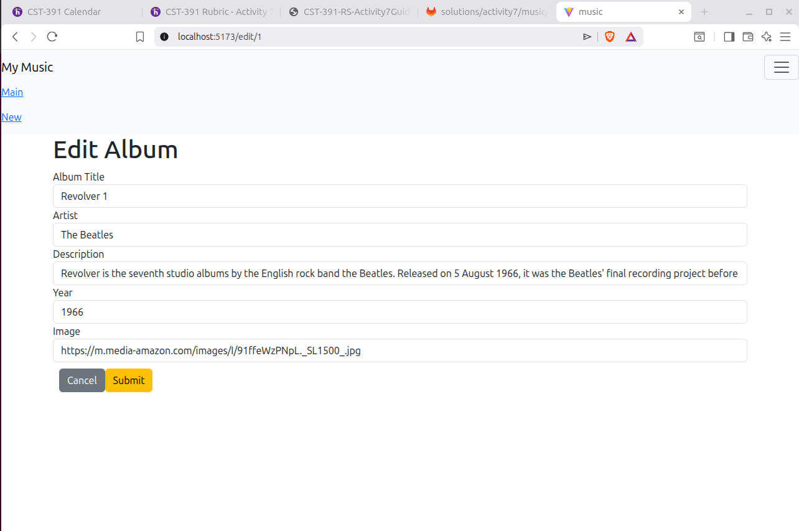
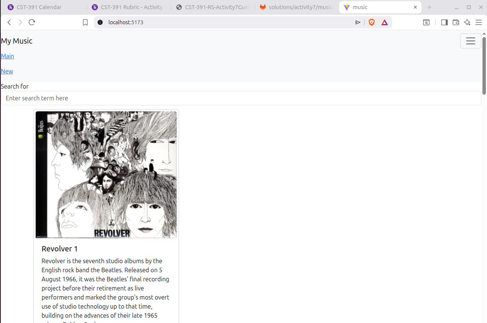

# Activity 7
- Author: Rodrigo Cornidez
- Date: March 28, 2026

# Introduction
This assignment covers some complex dynamic examples. We will be covering rendering out repetative components and passing values to child components (forms). We access values by passing props and using url parameters.

# Screenshots
## Mini App #3 (Dynamic Components Demo)
*This screenshot shows the dynamically rendered blog posts with the ability to be deleted and a AddPost component that creates new posts.*

## React Music App (Part 5 Tracks, Lyrics, and Video)
*This screenshot shows the dynamically rendered tracks for a selected album. We are able to select a track and display its lyrics. The dataset provided did not have any lyrics included I but to show that it was rendering I displayed the phrase "Lyrics are null" if the object returned as null. I excluded the video url because it is null as well in our dataset. Otherwise this would be a simple prop value passed to a child component just like the lyrics.*

## React Music App (Part 6 Create New Album)
### 1. New Page Form
*This screenshot shows the new form we've created. This allows me to create a new album and have it saved to the database using the axios service.*

### 2. Main Page Showing New Album
*This screenshot shows the new album we've created. Displayed in the albumList in the main page.*

### 3. Summary
I implemented the new album functionality based on the examples provided in the previously created mini app. This allowed me to create a form to accept a new album that is saved to the database with a POST request. This is then updated in the main pages AlbumList component providing it as a prop after calling the loadAlbums function.

## React Music App (Part 7 Edit an Album)
### 1. Edit Album Page Form
*This screenshot shows the new edit form we've created. This allows me to modify an album and have it updated in the database using the axios service.*

### 2. Main Page Showing Modified Album
*This screenshot shows the new album we've modified. The title has been changed from "Revolver" to "Revolver 1" Displayed in the albumList in the main page.*

### 3. Summary
I implemented the edit album functionality based on the examples we've covered. This allowed me to create a form to edit an existing album. This required passing the album list and accessing the albumId from the url parameters and filtering to access the correct object. As we submit the form a PUT request updates the album in the database and refreshes the album list in the main page.

# Conclusion
This activity provided a good foundation of working with dynamic components, forms with state, and accessing values using props and url parameters. We also covered using the axios service to facilitate backend interaction for POST and PUT calls.