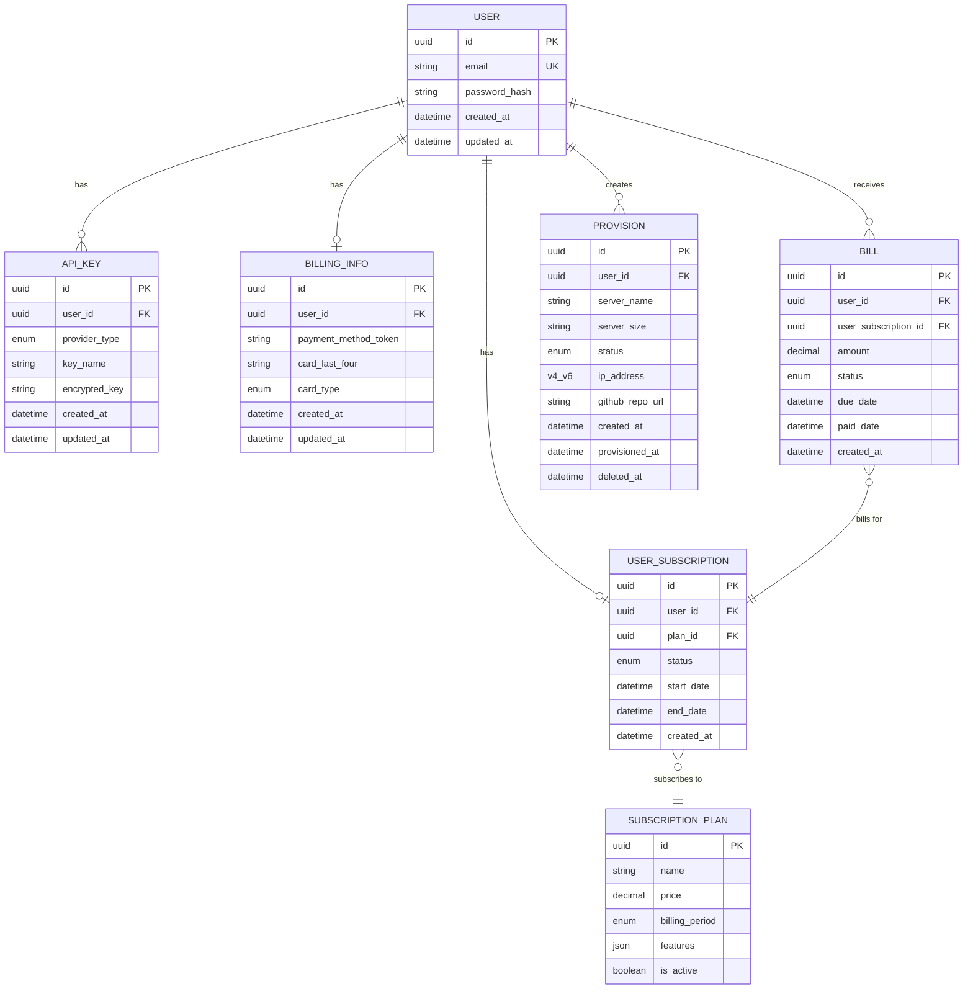
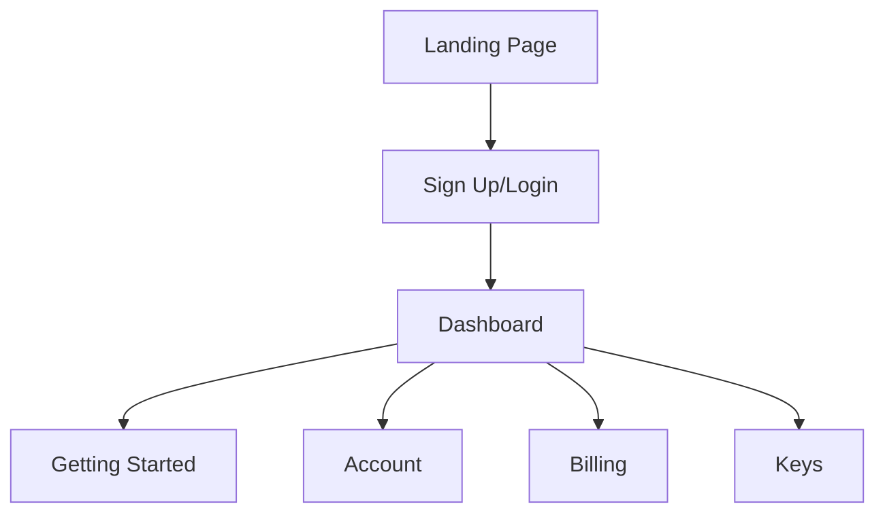
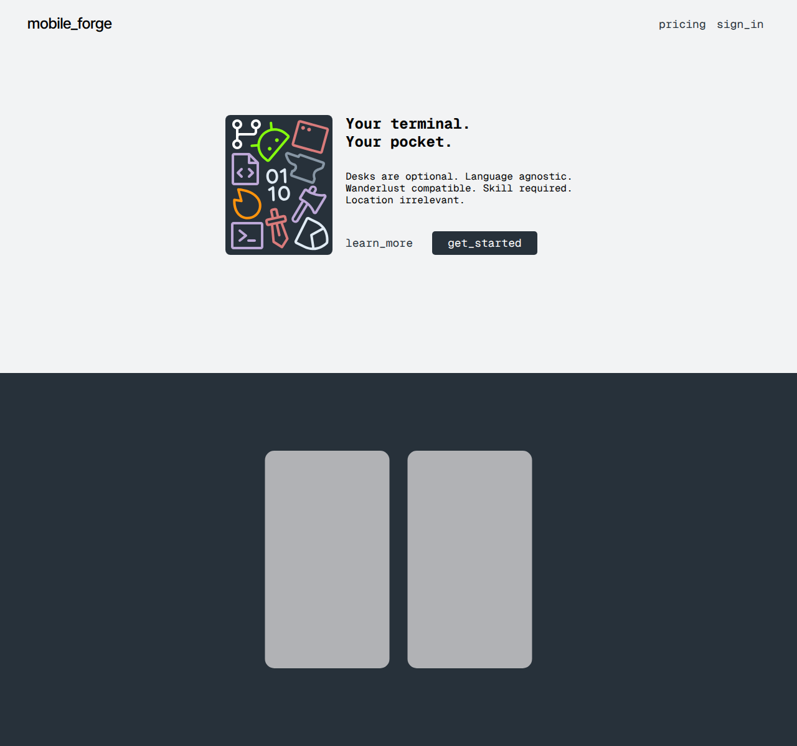
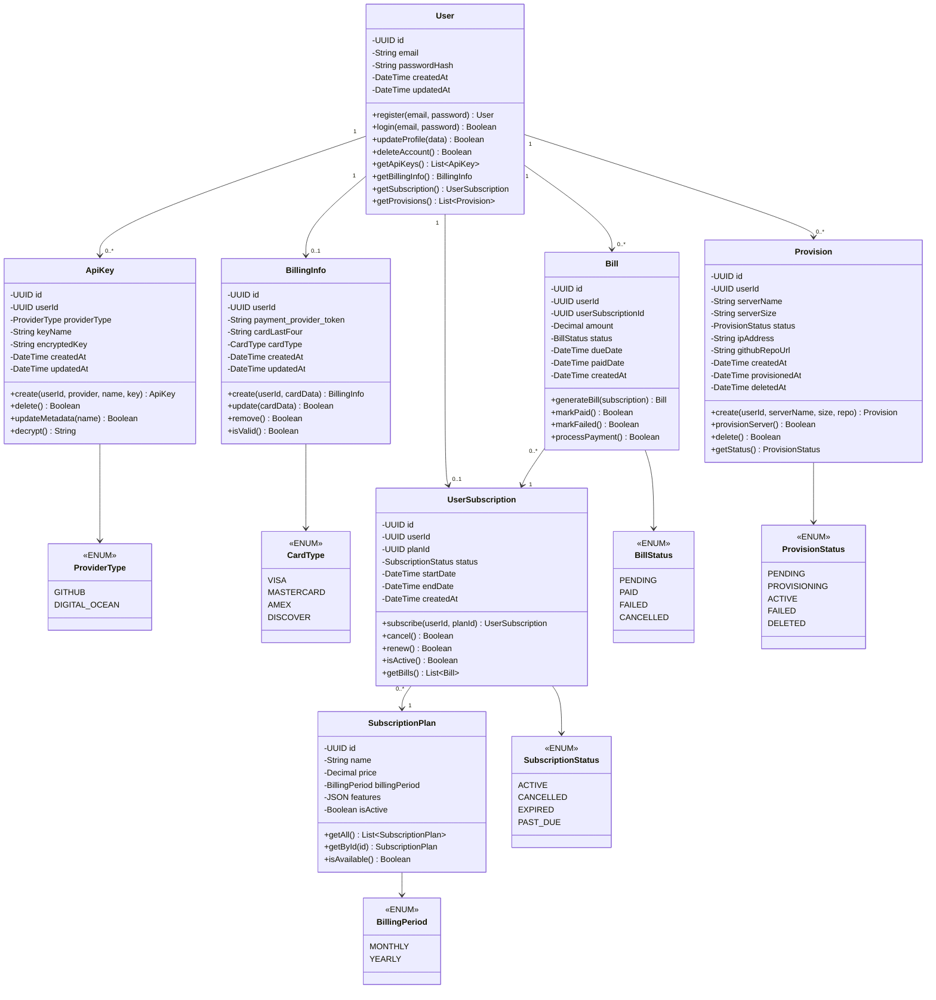

# Milestone 2
- Author: Rodrigo Cornidez
- Date: February 19, 2026

# Instructor Feedback
The feedback was positive, there were no direct changes needed at this stage: "Rodrigo, outstanding work and you Mermaid diagrams look fantastic, great work".

# Introduction
In this milestone assignment we are defining the API endpoints and request bodies to further refine our product ideas and 

Project Context:
I have been planning a mobile app design that allows users to develop on-the-go, the app is called MobileForge. I also own the domain mobileforge.app. The app will allow users to manually connect to servers with ssh access and a sftp text editor access. The functional requirements listed below are complimentary to this by offering a paid provisioning service that spins up a server and stages a project for a faster and convenient setup experience. The product that I'm selling is a subscription for this service.

# Requirements
1. User can self-register, login, update user information, and delete account.
2. User can select a subscription to purchase (this is the product).
3. User can add, update, and remove billing information.
4. User can add and delete API keys for GitHub and Digital Ocean. They can update the metadata only after creation.
5. User can provision a server with an optional cloning of a github repository with a minimal form: server name, select server size, select existing repository (optional).

# ER Diagram


# UI Sitemap


# UI Wireframe
## Landing Page

*The landing page has three sections: the call-to-action and demo screen recordings.*



## Sign Up / Login

*The Sign Up/ Login page has a dynamic form that will either have two fields for logging in or three fields for signing up.*


## Dashboard

*The Dashboard page has a navigation bar to the left and a content section on the right. The navigation links will be: Getting Started, Account, Billing, Keys. The content of these links are fairly minimal so they will navigate to sections using css ids instead of separate pages.*


# UML classes


# Risks
1. UI design changes to meet undiscovered needs.
2. Object/Entity changes for new actions or fields to meet undiscovered needs.

# REST Endpoints

### Auth
| Method | Endpoint | Description |
|---|---|---|
| POST | /auth/register | Create a new user account |
| POST | /auth/login | Authenticate and return a token |
| POST | /auth/logout | Invalidate the current token |

#### Sample Request
```json
// POST
{
  "email": "cornidez04@gmail.com",
  "password": "supersecretpassword"
}
```

### User
| Method | Endpoint | Description |
|---|---|---|
| GET | /users | Get the authenticated user's profile using the token |
| PUT | /users | Update the authenticated user's profile using the token |
| DELETE | /users | Permanently delete the authenticated user's account using the token |

#### Sample Request
```json
// PUT
{
  "email": "cornidez04@gmail.com",
  "password": "newpassword"
}
```

### API Keys
| Method | Endpoint | Description |
|---|---|---|
| GET | /keys | List all API keys for the authenticated user |
| POST | /keys | Add a new API key |
| PUT | /keys/:id | Update the metadata (name) of an API key |
| DELETE | /keys/:id | Delete an API key |

#### Sample Request
```json
// POST
{
  "provider_type": "github",
  "key_name": "My GitHub Key",
  "key": "apikey123"
}

// PUT
{
  "key_name": "Updated Key Name"
}
```

### Billing Info
| Method | Endpoint | Description |
|---|---|---|
| GET | /billing | Get the user's billing information using the token |
| POST | /billing | Create billing information using the token |
| PUT | /billing | Update billing information using the token |
| DELETE | /billing | Remove billing information using the token |

#### Sample Request
```json
// POST and PUT
{
  "payment_method_token": "payment_provider_token",
  "card_last_four": "4242",
  "card_type": "VISA"
}
```

### Bills
| Method | Endpoint | Description |
|---|---|---|
| GET | /bills | List all bills for the authenticated user |
| GET | /bills/:id | Get details of a specific bill |
| POST | /bills | Create a bill record |

#### Sample Request
```json
// POST
{
  "user_subscription_id": "UUID",
  "amount": 19.99,
  "due_date": "2026-03-01T00:00:00Z",
  "paid_date": "2026-02-18T00:00:00Z"
}
```

### Subscriptions
| Method | Endpoint | Description |
|---|---|---|
| GET | /subscription-plans | List all available subscription plans |
| GET | /subscription-plans/:id | Get details of a specific subscription plan |
| GET | /subscriptions | Get the user's current subscription using the token |
| POST | /subscriptions | Subscribe to a plan using the token |
| PUT | /subscriptions | Update the plan subscription using the token |
| DELETE | /subscriptions | Cancel the current subscription using the token|

#### Sample Request
```json
// POST and PUT
{
  "plan_id": "uuid"
}
```

### Provisions
| Method | Endpoint | Description |
|---|---|---|
| GET | /provisions | List all provisioned servers for the authenticated user |
| GET | /provisions/:id | Get details of a specific provision |
| POST | /provisions | Provision a new server |
| DELETE | /provisions/:id | Deprovision and delete a server |

#### Sample Request
```json
// POST
{
  "server_name": "my-project-server",
  "server_size": "s-1vcpu-1gb",
  "github_repo_url": "https://github.com/rodrigo/my-project"
}
```


# Conclusion
This assignment allowed me to take time to define the API endpoints that will be needed to meet the user requirements. I was able to define the HTTP methods, routes, definitions, and include sample request bodies.
