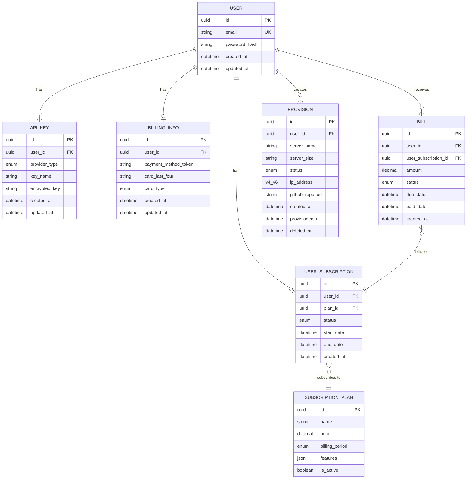
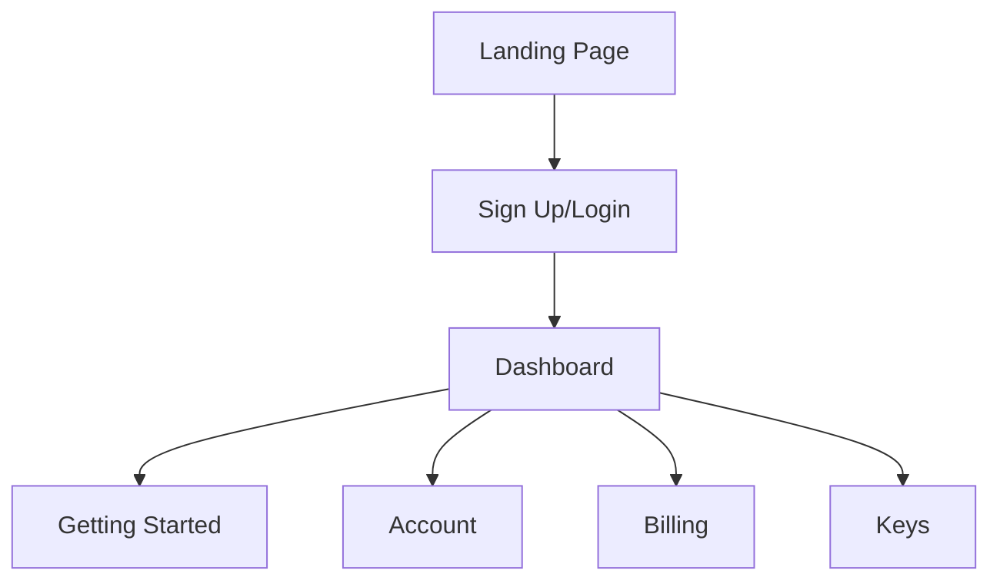
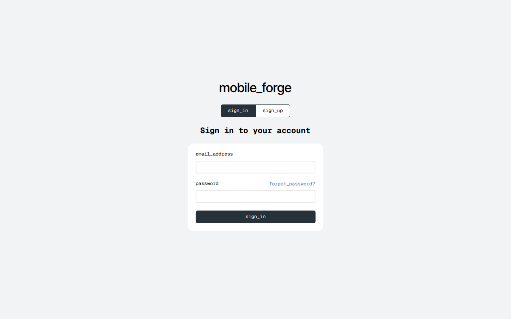
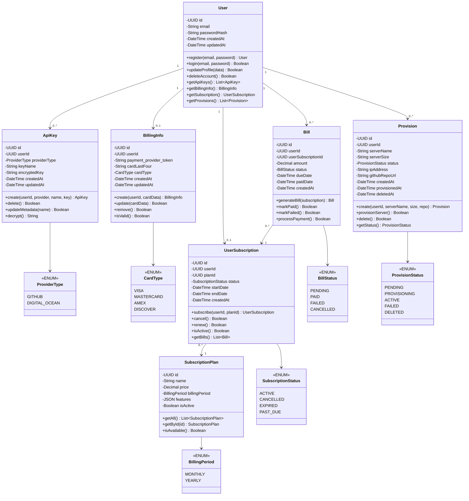

# Milestone 3
- Author: Rodrigo Cornidez
- Date: February 22, 2026

# Introduction
In this milestone assignment we are building out our previously designed API endpoints using Express and TypeScript.

# Powerpoint Presentation
- [File Download](./CST391-Milestone3-Benchmark.pptx)
- [Online Link](https://mygcuedu6961-my.sharepoint.com/:p:/g/personal/rcornidez_my_gcu_edu/IQCIsSxYovflQrZO5Ipt6I5AAWtVBEOaXOfo5nz0koXlYAE?e=Cb01HB)

# Requirements
> Note: I have been planning a mobile app design that allows users to develop on-the-go, the app is called MobileForge. I also own the domain mobileforge.app. The app will allow users to manually connect to servers with ssh access and a sftp text editor access. The functional requirements listed below are complimentary to this by offering a paid provisioning service that spins up a server and stages a project for a faster and convenient setup experience. The product that I'm selling is a subscription for this service.

1. User can self-register, login, update user information, and delete account.
2. User can select a subscription to purchase (this is the product).
3. User can add, update, and remove billing information.
4. User can add and delete API keys for GitHub and Digital Ocean. They can update the metadata only after creation.
5. User can provision a server with an optional cloning of a github repository with a minimal form: server name, select server size, select existing repository (optional).

# ER Diagram


# UI Sitemap


# UI Wireframe
## Landing Page

*The landing page has three sections: the call-to-action and demo screen recordings.*


## Sign Up / Login

*The Sign Up/ Login page has a dynamic form that will either have two fields for logging in or three fields for signing up.*



## Dashboard

*The Dashboard page has a navigation bar to the left and a content section on the right. The navigation links will be: Getting Started, Account, Billing, Keys. The content of these links are fairly minimal so they will navigate to sections using css ids instead of separate pages.*


# UML classes


# Risks
1. UI design changes to meet undiscovered needs.
2. Object/Entity changes for new actions or fields to meet undiscovered needs.

# REST Endpoints

Base URL: `http://localhost:5000`

- [Postman collection export (file)](./mobile-forge.postman_collection.json)
- [Postman online collection](https://.postman.co/workspace/Personal-Workspace~d349e5d2-322d-4a5e-96ff-1ad0c5854d6c/collection/40780938-2127678f-ca93-44be-bb7b-ed27e90a7614?action=share&creator=40780938)
---

## Auth

| Method | Endpoint | Description |
|--------|----------|-------------|
| POST | /auth/register | Create a new user account |
| POST | /auth/login | Authenticate and return a token |
| POST | /auth/logout | Invalidate the current token |

Sample Request
```json
// POST /auth/register and /auth/login
{
  "email": "cornidez04@gmail.com",
  "password": "supersecretpassword"
}
```

---

## API Keys

| Method | Endpoint | Description |
|--------|----------|-------------|
| GET | /keys | List all API keys for the authenticated user |
| POST | /keys | Add a new API key |
| PUT | /keys/:id | Update the name of an API key |
| DELETE | /keys/:id | Delete an API key |

Sample Request
```json
// POST
{
  "providerType": "GITHUB",
  "keyName": "My GitHub Key",
  "apiKey": "supersecretkey"
}

// PUT
{
  "keyName": "Updated Key Name"
}
```

---

## Billing Info

| Method | Endpoint | Description |
|--------|----------|-------------|
| GET | /billing | Get the user's billing information |
| POST | /billing | Create billing information |
| PUT | /billing | Update billing information |
| DELETE | /billing | Remove billing information |

Sample Request
```json
// POST and PUT
{
  "nameOnCard": "Rodrigo Cornidez",
  "cardNumber": "1111222233334444",
  "expMonth": 12,
  "expYear": 2027,
  "cvv": "123",
  "address": "123 Main St",
  "state": "AZ",
  "zip": "85001",
  "cardType": "VISA"
}
```

---

## Bills

| Method | Endpoint | Description |
|--------|----------|-------------|
| GET | /bills | List all bills for the authenticated user |
| GET | /bills/:id | Get details of a specific bill |

---

## Subscriptions

| Method | Endpoint | Description |
|--------|----------|-------------|
| GET | /subscription-plans | List all available subscription plans |
| GET | /subscription-plans/:id | Get details of a specific subscription plan |
| GET | /subscriptions | Get the user's current subscription |
| POST | /subscriptions | Subscribe to a plan |
| PUT | /subscriptions | Update the subscribed plan |
| DELETE | /subscriptions | Cancel the current subscription |

Sample Request
```json
// POST and PUT
{
  "planId": "4b8637e4-1048-11f1-a18e-ee385f104622"
}
```

---

## Provisions

| Method | Endpoint | Description |
|--------|----------|-------------|
| GET | /provisions | List all provisioned servers for the authenticated user |
| GET | /provisions/:id | Get details of a specific provision |
| POST | /provisions | Provision a new server |
| DELETE | /provisions/:id | Deprovision and delete a server |

Sample Request
```json
// POST
{
  "serverName": "my-sample-server",
  "serverSize": "s-1vcpu-1gb",
  "githubRepoUrl": "https://github.com/sample/repo"
}
```

# Conclusion
This assignment contained a fairly large initial feature list (6 in total). I enjoyed the process of defining the schema, model, queries, dao, controller and routes. As well as building the required supporting code to enable the user requirements: services, utilities, and middleware. I created mocks for the external service dependencies for now (payments and provisioning).
